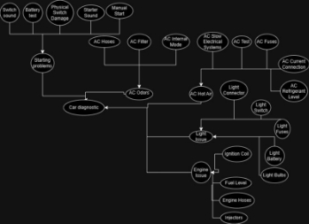
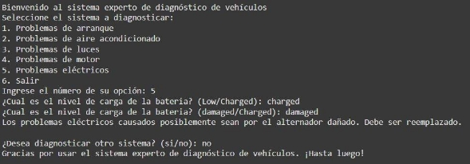
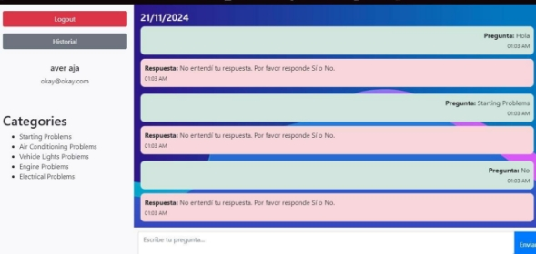
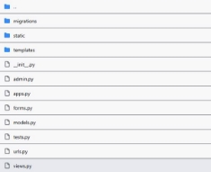
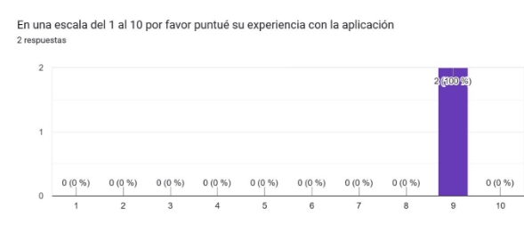
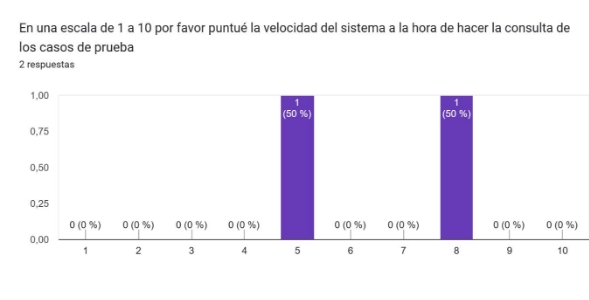
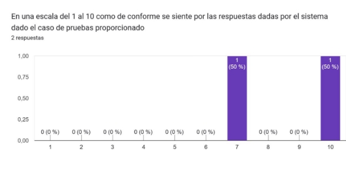
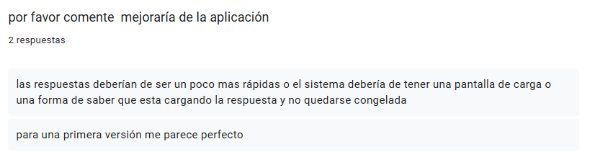

Report: Expert system for car diagnosis 

Members:  

- Johan Aguirre 
- Rafaela Ruiz   
- Alejandro Amú. 

Introduction 

The Car Diagnostic Expert System is projected to assist users, especially young adults 

with little or no experience in automotive mechanics, in diagnosing ordinary problems with their vehicles. By adopting an expert system in the form of a chatbot, the system hopes to offer immediate, accessible, and practical solutions to starting problems, air conditioning malfunctioning, lighting issues, engine failure, and electrical faults in cars. 

The report provides a description of the overall scope, design, implementation, testing, and future potential for the system. 

Problem Statement and Objectives

**Problem Statement:** 

Car owners often experience difficulties diagnosing and resolving vehicle issues due to a lack of technical knowledge. Traditional vehicle diagnostics can be costly, time-consuming, and may require specialized tools and services that are not always accessible. There is a need for a more accessible, digital solution to help car owners identify problems and implement basic solutions. 

**Objectives:** 

- Develop an expert system that can diagnose common automotive issues based on user-input symptoms. 
- Provide easy-to-understand solutions and recommendations that do not require specialized equipment. 
- Ensure that the system is accessible to users without technical expertise in automotive mechanics. 
- Offer a chatbot interface that provides real-time diagnoses and advice. 

Requirements Analysis 

**Functional Requirements.** Interaction Chatbot: 

The system must function as an intuitive chatbot, where the user can enter symptoms observed on the vehicle. 

The chatbot must be able to handle multiple symptoms at once to provide a more accurate diagnosis. 

It should provide explanations of each symptom and possible causes, along with recommendations for actions the user can try.

Symptom-Based Diagnosis: 

The system should include at least 20 diagnostic problems, 10 of which should be based on multiple conditions, increasing diagnostic accuracy.

The system must offer solutions that can be performed without specialized equipment and are safe for the user. 

User Friendly Interface: 

The interface should be designed for a young audience, be visually appealing and easy to use. It should allow the user to select or enter symptoms without complexity.

**Non-functional Requirements** 

- Accessibility and Availability: 

The system must be accessible at any time to serve users at the time they are presented with the automotive problem. 

The application must be easy to use and accessible to people with basic knowledge in the use of technology. 

Scalability: 

The system must be ready to receive and process queries efficiently as the number of users increases. 

Maintainability: 

The system should be easily upgradable to include new problems and solutions in the future, according to evolving problems and user needs.

For more information about the requirements, user interaction flow and project scope consult the requirements analysis document 

Knowledge Acquisition and Representation

For the Knowledge Acquisition we did an interview with an experienced mechanic, and we consulted the user guide for common problems of multiple vehicles (the interviews can be consulted in the interview folder of the project), and we reach the most common problems presented in the vehicles that were categorized in 5: 

- Starting problems 
- Air conditioning operation problems (divided into two parts Bad odors and Hot air) 
- Problems with the vehicle lights 
- Engine problems 
- Electrical problems 

With the help of the expert, we reach also the question that needs to be asked to make a correct diagnosis and the probability of the solution being correct  

For more detailed information about in the document Knowledge Acquisition 

With all the information we realize the Bayesian network in the diagram that finishes being in the next way: 

System Design 

Regarding the system design, the following actions were carried out:

Regarding the graphic interface, one was made for validations and tests and another interface with which the final users of the application would interact, which looked as follows:

CLI interface:

Web  interface : 

The database management is actually a series of json files that store the history of user conversations with the Bot and these files are stored in a SQLite database. 

For the inference engine we used the probabilities given by the expert and the Bayesian network previously designed which looks as follows:

Implementation Details 

For the implementation of the expert system, we made use of the experta and pgmpy libraries, additionally the framework used for the front end was Django. 

Code fragment of the implementation of the expert with experta:

Use of the Django framework: 

Testing and Validation 

For validation and testing we first made a detailed test plan on how to handle both unit tests and tests with real users using prototypes in this case two prototypes were presented, the one that made use of the CLI and the web interface.

First the unit tests were performed, which range from the load capacity of the application without errors, the average response time, etc. The results in the undeployed version were satisfactory, but in the deployed version the results were altered due to the extra time needed for the assembled application to perform queries between the back and the front.

On the other hand, tests were also performed with users using both graphical interfaces and validations were performed with the expert that resulted in improvements in the probabilities given. 

Results of the post-test user surveys (htt[ps://forms.gle/y4SCMk4QXmtgPXnu7):](https://forms.gle/y4SCMk4QXmtgPXnu7)

For details on the tests themselves see the Test plan design document, for more in-depth user and expert reviews see the interviews folder.

Deployment 

For the deployment, the application was mounted on a free hosting system such as vercel, however we had problems when mounting the database with the system because we did not find a known hosting that allowed us to mount the database correctly (Rip elefhant sql).

Conclusion and Future Work 

The Car Diagnostic Expert System is an innovative solution that leverages expert system technologies to provide accessible and practical vehicle diagnostics. The system meets the primary objectives of assisting users in diagnosing common car problems and offering solutions in a user-friendly manner. 

**Future Work:** 

- **Expansion of Knowledge Base:** Add more car problems and solutions to enhance the diagnostic capabilities. 
- **Multilingual Support:** Expand the system to support multiple languages to reach a broader audience. 
- **Mobile Application:** Develop a mobile version of the system for greater accessibility.

References 

[https://www.team-bhp.com/forum/technical-stuff/121153-flow-charts-troubleshooting-car- problems.html ](https://www.team-bhp.com/forum/technical-stuff/121153-flow-charts-troubleshooting-car-problems.html)

[https://www.onallcylinders.com/2016/12/14/infographic-guide-to-diagnosing-common - starting-problems/ ](https://www.onallcylinders.com/2016/12/14/infographic-guide-to-diagnosing-common-starting-problems/)
